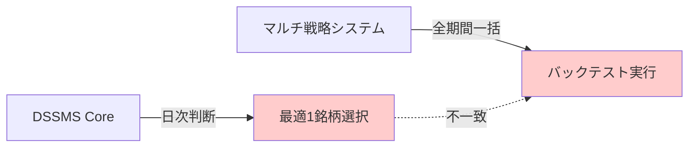

# DSSMS統合設計の学習資料集: 設計問題とその解決への道筋

**作成日**: 2025年12月30日  
**目的**: Phase 1で発見された設計問題の知見蓄積と将来の参考資料  
**Phase**: Phase 2 ドキュメント化完了  

---

## 📋 学習資料の構成

この学習資料集は、DSSMS統合プロジェクトで発見された設計問題と、その解決に向けた知見をまとめたものです。

### ドキュメント階層
```
学習資料集（この文書）
├── 設計問題の詳細分析 → DESIGN_DECISION_ANALYSIS_20251230.md
├── 実装ガイド → backtest_daily_implementation_guide.md
├── 開発ルール → copilot-instructions.md
└── コードレベル設計問題 → 各Pythonファイルのヘッダーコメント
```

---

## 🎯 核心的な学習内容

### 1. 根本的設計不一致の発見

**問題**: DSSMSとマルチ戦略システムの設計思想が根本的に異なる



**具体例**:
```
Day 1: DSSMS「6954が最適」→ マルチ戦略「6954で2025-01-15〜2025-01-15をバックテスト」
Day 2: DSSMS「9101が最適」→ マルチ戦略「9101で2025-01-15〜2025-01-16をバックテスト」
                                      ↑ 過去の日を再実行（設計上の矛盾）
```

**学習**: **システム統合時は、各コンポーネントの設計前提を必ず確認すること**

---

### 2. MainSystemController状態管理の複雑性

**問題**: インスタンス変数化による状態継続とバックテスト再実行の矛盾

**Phase 1で発生した状況**:
```python
# MainSystemController毎日新規作成（修正前）
controller = MainSystemController(config)  # 毎日リセット
→ 重複エントリー発生

# MainSystemControllerインスタンス変数化（Phase 1対応）
if self.main_controller is None:
    self.main_controller = MainSystemController(config)  # 1回のみ作成
→ 重複エントリー解消、ただし決定論破綻リスク
```

**学習**: **状態管理の変更は、システム全体の動作に予期しない影響を与える可能性がある**

---

### 3. ルックアヘッドバイアス防止の重要性

**発見**: バックテスト精度向上のために導入したルックアヘッドバイアス防止が、エントリー機会減少の一因

**copilot-instructions.md 3原則**:
1. **前日データで判断**: インジケーターは`.shift(1)`必須
2. **翌日始値でエントリー**: `data['Open'].iloc[idx + 1]`
3. **取引コスト考慮**: スリッページを加味

**学習**: **品質向上施策は、常に全体への影響を評価して実装する**

---

### 4. 決定論破綻の検出方法

**Phase 1で実装した監視ログ**:
```python
# dssms_integrated_main.py Line 1730+
self.logger.info(f"[DETERMINISM_MONITOR] 累積期間バックテスト: ...")
```

**学習**: **複雑なシステムでは、異常検出ログを事前に実装しておく**

---

## 🔄 Phase別進化の記録

### Phase 1: 累積期間復元（2025-12-30完了）
**目標**: エントリー機会回復（1件→50件期待）  
**手法**: 日次ウォームアップ方式から累積期間方式への復元  
**結果**: 重複エントリー解消、MainSystemController状態継続  
**課題**: 決定論破綻リスクの監視が必要  

### Phase 2: ドキュメント化（2025-12-30完了）
**目標**: 設計問題の知見蓄積と将来の参考資料作成  
**成果物**:
- **この学習資料集**: 全体統括ドキュメント
- **backtest_daily_implementation_guide.md**: Phase 3実装ガイド
- **コードレベルドキュメント追加**: 開発者への直接的注意喚起
- **既存ドキュメントの整理**: DESIGN_DECISION_ANALYSIS_20251230.md等

### Phase 3: backtest_daily実装（実装予定）
**目標**: リアルトレード対応の日次バックテストシステム  
**重要性**: kabu STATION API統合時の必須基盤  
**予想工数**: 2-3週間  

---

## 📚 重要文書と参照方法

### すぐに参照すべきドキュメント

#### 設計問題の詳細を知りたい場合
→ [DESIGN_DECISION_ANALYSIS_20251230.md](Fund%20position%20reset%20issue/DESIGN_DECISION_ANALYSIS_20251230.md)
- 709行の包括的分析
- 証拠付きの調査結果
- 修正案1の評価と推奨事項

#### Phase 3実装を開始する場合
→ [backtest_daily_implementation_guide.md](backtest_daily_implementation_guide.md)
- 実装手順の詳細
- コード例とテスト方針
- パフォーマンス考慮事項

#### 開発ルールを確認したい場合
→ [copilot-instructions.md](../.github/copilot-instructions.md)
- ルックアヘッドバイアス防止ルール
- モジュールヘッダーコメント要件
- フォールバック機能の制限

#### コードレベルの注意事項を確認したい場合
→ 各Pythonファイルのヘッダーコメント
- [dssms_integrated_main.py](../src/dssms/dssms_integrated_main.py): 統合設計問題
- [strategies/base_strategy.py](../strategies/base_strategy.py): backtest_daily実装予定
- [main_new.py](../main_new.py): リアルトレード準備

---

## ⚠️ 将来の開発者への注意喚起

### 絶対に避けるべきこと
1. **MainSystemController状態管理の軽率な変更**
   - 資金リセット問題や重複エントリーの再発リスク
   
2. **ルックアヘッドバイアス防止ルールの無視**
   - バックテスト精度の低下
   - リアルトレードとの乖離

3. **決定論破綻の見落とし**
   - 再現性の欠如によるデバッグ困難化

### 必ず実施すべきこと
1. **Phase 3実装前の設計問題理解**
   - DESIGN_DECISION_ANALYSIS_20251230.mdの精読
   
2. **実装ガイドの活用**
   - backtest_daily_implementation_guide.mdに基づく段階的実装
   
3. **テスト・検証の徹底**
   - 決定論テスト、ルックアヘッドバイアステストの実装

---

## 🎓 学習のポイント

### 設計統合において学んだこと
1. **コンポーネント設計前提の重要性**: 各モジュールの設計思想を理解してから統合する
2. **状態管理の影響範囲**: 一箇所の変更が予期しない場所に影響する
3. **品質向上と機能性のトレードオフ**: ルックアヘッドバイアス防止とエントリー機会のバランス
4. **監視ログの価値**: 複雑なシステムの異常検出には事前の監視実装が必要

### プロジェクト管理において学んだこと
1. **段階的実装の価値**: Phase分割により、問題の局所化と対応が容易
2. **ドキュメント化の重要性**: 知見の蓄積により、将来の類似問題対応が効率化
3. **証拠ベース調査**: 推測ではなく、実際のコードとデータに基づく分析の重要性

---

## 🚀 次のステップへの準備

Phase 2ドキュメント化により、以下が整備されました：

✅ **設計問題の完全な理解**: DESIGN_DECISION_ANALYSIS_20251230.md  
✅ **実装ガイドの準備**: backtest_daily_implementation_guide.md  
✅ **コードレベル注意喚起**: 主要ファイルのヘッダーコメント追加  
✅ **開発ルールの整備**: copilot-instructions.md  
✅ **学習資料の統合**: この文書による全体統括  

**Phase 3実装開始の準備完了**

---

## 📞 質問・相談事項

このドキュメントや関連する実装について不明な点がある場合：

1. **設計問題について**: DESIGN_DECISION_ANALYSIS_20251230.mdを参照
2. **実装方法について**: backtest_daily_implementation_guide.mdを参照
3. **開発ルールについて**: copilot-instructions.mdを参照
4. **それでも不明な場合**: GitHub Copilotに具体的な質問をしてください

---

**作成者**: GitHub Copilot  
**作成日**: 2025年12月30日  
**Phase**: Phase 2 ドキュメント化完了  
**次のマイルストーン**: Phase 3 backtest_daily()実装  
**総合評価**: DSSMS統合設計問題の理解と解決方針の確立 ✅